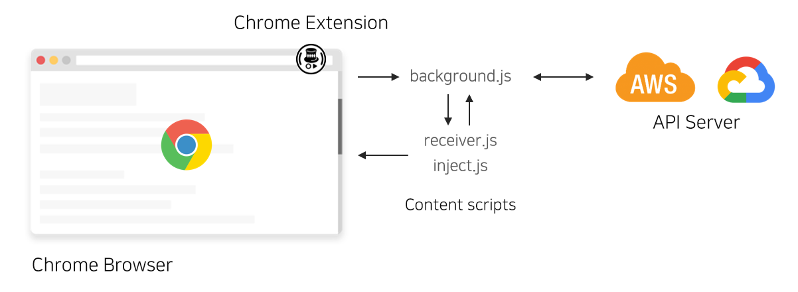

# Speech Translator Chrome Extension

<div align=center>


</div>

<div align=center>


[](https://travis-ci.org/joonas-yoon/speech-translator-server)
[](https://github.com/joonas-yoon/speech-translator/stargazers)
[](https://google.github.io/styleguide/jsguide.html)

</div>

This browser extension shows the translated results of speech from browser tab sound.

**The server** is available on [@joonas-yoon/speech-translator-server](https://github.com/joonas-yoon/speech-translator-server)

<div align=center>



</div>

## Dependencies

- [Google Chrome Extensions](https://developer.chrome.com/extensions/overview)
- [Google Cloud Speech-To-Text](https://cloud.google.com/speech-to-text/)
- [Google Cloud Storage](https://cloud.google.com/storage/)
- [Google Cloud Translation API](https://cloud.google.com/translate/)

## Chrome

Kill all chrome instances before running command:

Windows:

```
CMD> "C:\Program Files (x86)\Google\Chrome\Application\chrome.exe" --disable-web-security --user-data-dir="[temp directory here]"
```

Linux/Mac:

```
chromium-browser --disable-web-security --user-data-dir="[temp directory here]"
```

Getting started Chrome Extension:

- https://developer.chrome.com/extensions/getstarted

## Video

[](https://youtu.be/Dry5jo6nQF4)

Youtube: https://youtu.be/Dry5jo6nQF4

## Contributors

Always thanks for your contribution :+1:
