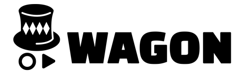

# Speech Translator Chrome Extension

  

  
  
  
  

This browser extension shows the translated results of speech from browser tab sound.

**The server** is available on [@joonas-yoon/speech-translator-server](https://github.com/joonas-yoon/speech-translator-server)

## Dependencies

- [Google Chrome Extensions](https://chrome.google.com/webstore/category/extensions)
- [Google Cloud Speech-To-Text](https://cloud.google.com/speech-to-text/)
- [Google Cloud Storage](https://cloud.google.com/storage/)
- [Google Cloud Translation API](https://cloud.google.com/translate/)

## Video

Youtube: https://youtu.be/Dry5jo6nQF4

## Contributors

Always thanks for your contribution :+1:
